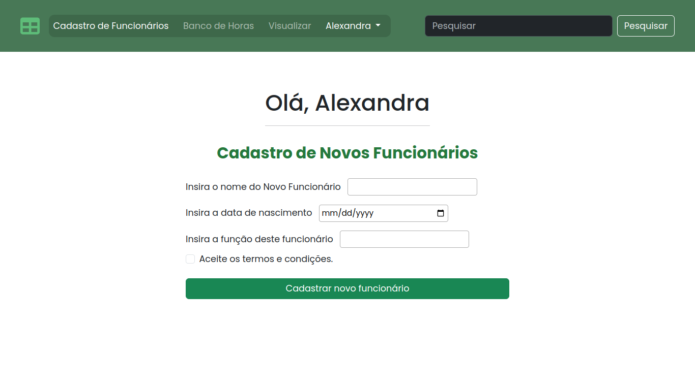
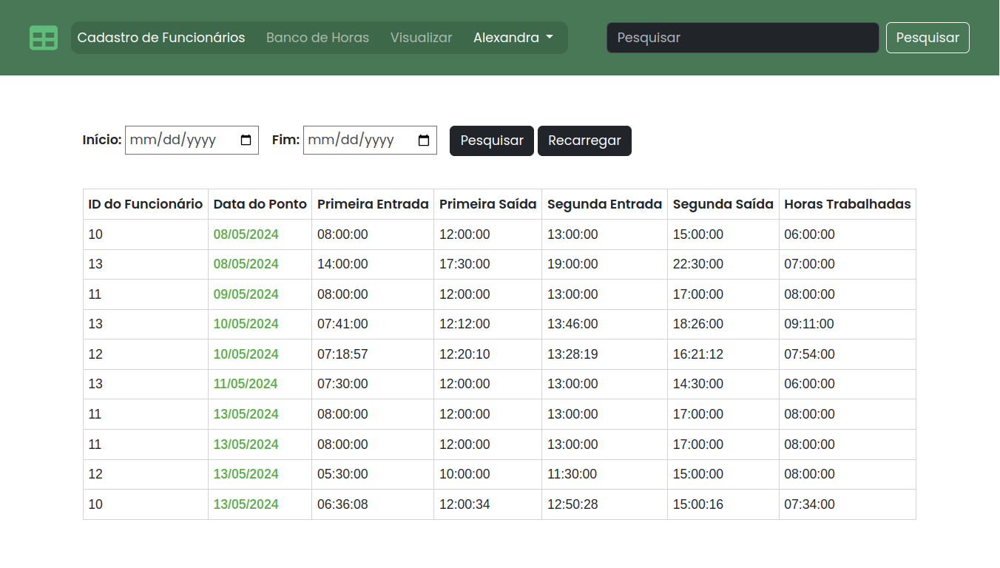

# Banco de Horas

## Estrutura do banco de dados
<ul>
    <li><b>Superior:</b> onde ele visualiza e cadastra novos funcionários, tendo acesso completo ao sistema.</li>
    <li><b>Funcionários:</b> "controlados" e monitorados pelo superior, onde são registrados pela primeira vez no sistema e computados seu banco de horas.</li>
    <li><b>Banco de horas:</b> tabela onde é calculado e visualizado a quantidade de horas que cada funcionário fez ao dia.</li>
</ul>

 

### Página Inicial

 

### Cadastro de Novos Funcionários

 

### Registro de Banco de Horas

 

### Visualização de Banco de Horas

Filtragem de data inicial e data final, mostrando como resultado a visualização do registro de banco de horas dos funcionários entre essas datas.

 

<h3>Tecnologias utilizadas:</h3>

 
 

<h2>Anotações e Estudos</h2>

<ul>
    <li><code>$_SERVER</code>: é uma <b>Variável global/superglobal</b> - variável disponível em todos os escopos do script, podendo ser chamada sempre que necessário sem declará-la (<i>global $variable</i>) Geralmente escritas em letras maiúsculas. -. É uma <i>array</i> contendo varios índices, que podem resultar em resultados diferentes para cada ocasião.</li>
     
    <li><b>MySQL</b> é um sistema de <b>gerenciamento de banco de dados relacional</b> que permite armazenar e manipular dados em tabelas. As <i>strings</i> são um tipo de dado comum em banco de dados MySQL e podem ser manipuladas com várias <u>funções de PHP</u>.</li>
     
    <li><code>mysqli_real_escape_string</code>: uma das formas mais comuns do PHP para <b:>manipulação de string em banco de dados MySQL</b>. Usada para escapar caracteres especiais em uma string antes de ser inserida em uma consulta SQL, evitando a injeção de SQL. Importante para garantir a segurança do banco de dados e evitar vulnerabilidades de segurança.</li>
     
    <li><code>query</code>: pedido de uma informação ou de um dado. Esse pedido também pode ser entendido como uma consulta, solicitação ou uma requisição. Executa uma consulta no banco de dados.</li>
     
    <li><code>num_rows</code>: retorna o número de linhas no resultado, por exemplo, o número de linhas contidas em uma determinada tabela.</li>
     
    <li><code>session_regenerate_id()</code>: atualiza/substitui o ID da sessão atual por um novo, mantendo as informações desta sessão. Não funciona corretamente com redes instáveis (móvel, WiFi, etc). O ID da sessão deve ser alterado em qualquer transição no estado de autenticação e apenas em transições de autenticação.</li>
     
    <li><code>htmlspecialchars()</code>: converte caracteres especiais em entidades HTML, devolvendo uma string baseado nas conversões realizadas. Certos caracteres tem um significado especial em HTML e devem ser representados por entidades HTML, preservando seu significado.</li>
     
    <li><code>connect_error</code>: retorna uma descrição/mensagem do último erro da tentativa de conexão. Não possui parâmetros. O valor retornado caso <b>true</b> é uma string que descreve o erro; <b>null</b> é retornado se nenhum erro tiver ocorrido.</li>
     
    <li><code>close</code>: Fecha uma conexão de banco de dados aberta anteriormente. Agora na versão do PHP 8 esta função sempre retorna <i>true</i>. Anteriormente retornava <i>false</i> em caso de falha.</li>
     
    <li><code>createFromFormat</code>: Interpreta uma string de data/hora de acordo com um formato especificado. Retorna um novo objeto <i>DateTime</i> representando a data e a hora especificadas pelo string <b>datetime</b>, que foi formatado de acordo com o parâmetro <b>format</b> fornecido.</li>
     
    <li><code>DateTime</code>: representação de data e hora.</li>
     
    <li><code>fetch_array()</code>: recebe uma linha de dados do conjunto de resultados e retorna-a como um array, <i>null</i> se não houver mais linhas no resultado, ou <i>false</i> em caso de falha.</li>
     
    <li><code>INNER JOIN</code>: retornar os registros que tenham correspondência nas duas tabelas presentes na junção.</li>
     
    <li><code>CONSTRAINT</code>: regras aplicadas ao banco de dados que permite que você configure as características de uma determinada coluna, com valores como: NOT NULL, UNIQUE, CHECK, PRIMARY KEY, FOREIGN KEY.</li>
     
    <li><code>charset</code>: (Character Sets) conjunto de caracteres codificado que vai ser utilizado na folha de estilo.</li>
     
    <li><code>ERRMODE_EXCEPTION</code>: além de definir o código de erro, o PDO lançará um PDOException e definirá suas propriedades para refletir o código de erro e as informações de erro, apontando o erro no script.</li>
     
    <li><code>PDOException</code>: representa um erro levantado pelo PDO. Não se deve lançar um PDOException de dentro do código do usuário.</li>
     
    <li><code>getMessage()</code>: obtém a mensagem da exceção como uma string. Apenas acontece caso tenha algum erro, mostrando a mensagem de erro.</li>
     
    <li><code>getCode()</code>: obtém o código da exceção, retornando um <i>integer</i>, a linha do código que está com erro.</li>
     
    <li><code>stmt</code>: prepara uma declaração SQL para execução, salvando a variável no banco de dados.</li>
     
    <li><code>str_pad</code>: preenche uma string até um determinado comprimento com outra string.</li>
     
    <li><code>implode</code>: o <b>implode</b> possui dois parâmetros, a primeira contendo uma string, que é o que vai ser usado para "juntar" todos os elementos; e no segundo parâmetro, uma array.</li>
</ul>

 
 

<h3>Bibliografia</h3>

<ol>
    <li><a href="https://www.php.net/manual/pt_BR/reserved.variables.server.php">Variável $_SERVER</a> by <b>php.net</b></li>
     
    <li><a href="https://blog.tiagomatos.com/dica-sobre-a-variavel-global-server-do-php/">Dica sobre a variável global $_SERVER do PHP</a> by <b>Tiago Matos</b></li>
     
    <li><a href="https://pt.linkedin.com/pulse/manipula%C3%A7%C3%A3o-de-strings-php-em-mysql-e-matos-?utm_source=share&utm_medium=guest_desktop&utm_campaign=copy">Mainupulação de strings PHP em MySQL</a> by <b>E Matos</b></li>
     
    <li><a href="https://www.hostinger.com.br/tutoriais/o-que-e-query">Query em Banco de Dados</a> by <b>Hostinger</b></li>
     
    <li><a href="https://www.php.net/manual/pt_BR/mysqli-result.num-rows.php">mysqli_num_rows</a> by <b>php.net</b></li>
     
    <li><a href="https://www.php.net/manual/pt_BR/function.session-regenerate-id.php">session_regenerate_id</a> by <b>php.net</b></li>
     
    <li><a href="https://www.php.net/manual/en/function.htmlspecialchars.php">htmlspecialchars</a> by <b>php.net</b></li>
     
    <li><a href="https://www.php.net/manual/pt_BR/mysqli.connect-error.php">mysqli_connect_error</a> by <b>php.net</b></li>
     
    <li><a href="https://www.php.net/manual/pt_BR/language.operators.logical.php">Operadores Lógicos</a> by <b>php.net</b></li>
     
    <li><a href="https://getbootstrap.com/">Booststrap Docs</a> by <b>Bootstrap</b></li>
     
    <li><a href="https://www.alura.com.br/artigos/manipulando-datas-e-horarios-com-php">Manipulando datas e horários com PHP</a> by <b>Alura</b></li>
     
    <li><a href="https://www.php.net/manual/en/function.date.php">date</a> by <b>php.net</b></li>
     
    <li><a href="https://www.w3schools.com/php/func_date_create_from_format.asp">PHP date_create_from_format() Function</a> by <b>w3Schools</b></li>
     
    <li><a href="https://www.php.net/manual/pt_BR/mysqli-result.fetch-array.php">mysqli_fetch_array</a> by <b>php.net</b></li>
     
    <li><a href="https://www.hashtagtreinamentos.com/constraints-no-sql?gad_source=1&gclid=EAIaIQobChMI-s7_1NiAhgMVb43CCB0h8QpPEAAYASAAEgL-kPD_BwE">Constraints no SQL – O que são e Por Que Você Deve Usá-las?</a> by <b>Hashtag Treinamentos</b></li>
     
    <li><a href="https://www.locaweb.com.br/ajuda/wiki/tudo-sobre-o-php-data-object-pdo-hospedagem-de-sites/">Tudo sobre o PHP Data Object PDO</a> by <b>locaweb</b></li>
     
    <li><a href="https://blog.dbins.com.br/calcular-a-diferenca-entre-horas-utilizando-php">Calcular a diferença entre horas utilizando PHP</a> by <b>BINS</b></li>
</ol>

